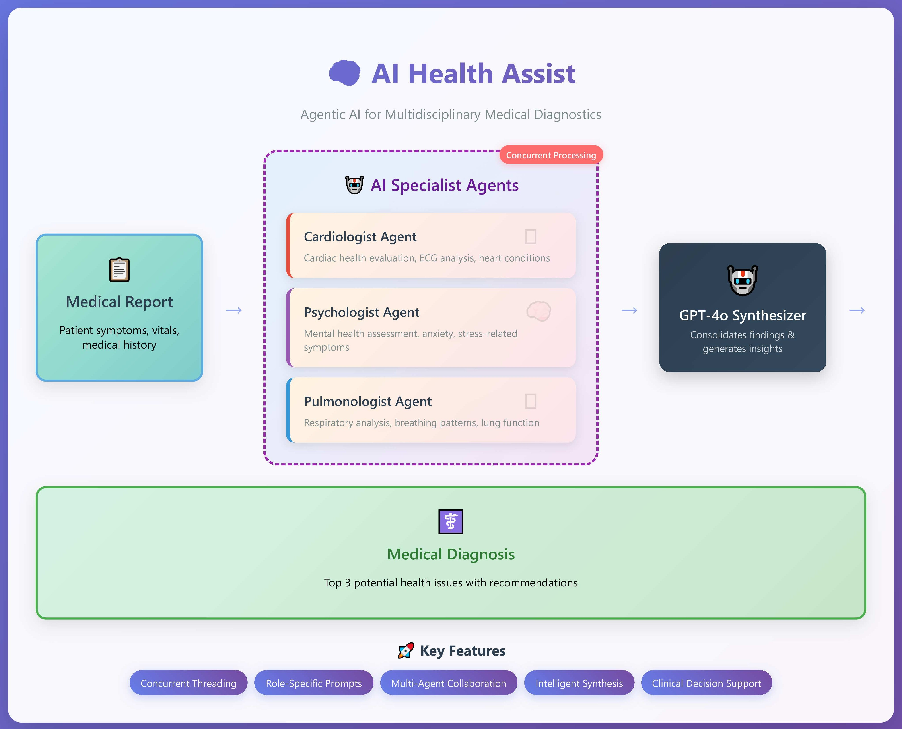

Here's an enhanced and updated version of your README file for your **Health Assistance AI project** with better structure, clarity, and modern wording aligned with **Agentic AI concepts**:

---

# 🧠 AI Health Assist – Agentic AI for Multidisciplinary Medical Diagnostics



An agentic AI-powered system designed to simulate a multidisciplinary team of medical specialists. This Python project leverages large language models (LLMs) like GPT-4o to create domain-specific AI agents—each offering expert-level assessments and personalized treatment suggestions. The collaborative intelligence of these agents demonstrates how AI can augment clinical decision-making across cardiology, psychology, and pulmonology.

---

## 🚀 Project Overview

In the current version, three autonomous AI agents operate in parallel using Python threading to analyze a shared medical report. Each agent specializes in a distinct field of medicine and contributes a unique perspective. Their outputs are then synthesized by a central LLM-based summarizer, which consolidates insights and highlights **three potential health issues** relevant to the patient.

---

## 🧩 Active AI Agents

### 🫀 Cardiologist Agent

* **Objective**: Evaluate cardiac health and detect conditions like arrhythmias or structural abnormalities that might be overlooked in initial testing.
* **Capabilities**: Recommends ECG, Holter monitoring, or imaging tests. Provides insights on heart-focused treatment strategies.

### 🧘 Psychologist Agent

* **Objective**: Identify psychological contributors such as anxiety, panic disorders, or stress-induced symptoms.
* **Capabilities**: Suggests therapy methods, mindfulness practices, medication options, and behavioral strategies.

### 🌬️ Pulmonologist Agent

* **Objective**: Examine respiratory factors such as asthma, hyperventilation, or other pulmonary conditions mimicking cardiac symptoms.
* **Capabilities**: Advises on spirometry, bronchial challenge testing, and provides guidance on breathing exercises or inhalers.

---

## 🛠️ Tech Stack & Agentic Workflow

* **LLM**: OpenAI GPT-4o
* **Methodology**: Concurrent agent execution with `threading`
* **Agent Architecture**: Role-specific prompt engineering
* **Final Summarizer**: Aggregates and deduplicates agent findings
* **Data Handling**: Structured synthetic medical reports

---

## 🔮 Future Roadmap

* **Expand Agent Pool**: Add specialists in neurology, endocrinology, gastroenterology, dermatology, and more.
* **Integration with OpenAI Assistant API**: Utilize `function calling` and `code interpreter` for dynamic report parsing and tool execution.
* **Advanced Medical Report Parsing**: Introduce semantic chunking and multimodal inputs (e.g., PDFs, lab charts, x-rays via OCR/Vision models).
* **Patient Interaction**: Enable patient-side conversational interface for query resolution, appointment routing, and next-step planning.

---

## 📁 Repository Structure

```bash
.
├── medical_reports/        # Sample or synthetic medical input files
├── results/                # Output from agent evaluations
├── agents/                 # Codebase for individual AI agents
├── main.py                 # Orchestrator script
├── apikey.env              # Your OpenAI API key goes here
```

> 💡 To run this project:
> Add your OpenAI API key inside `apikey.env`.

---

## 👨‍⚕️ Target Use Cases

* Early-stage symptom screening
* Clinical decision support for general physicians
* AI-assisted telemedicine consultations
* Rural/remote health diagnostics where multi-specialty advice isn’t available

---

## 🧪 Disclaimer

This tool is meant for **educational and experimental** use only. It does **not replace professional medical advice** or diagnosis. Always consult a licensed medical practitioner.
